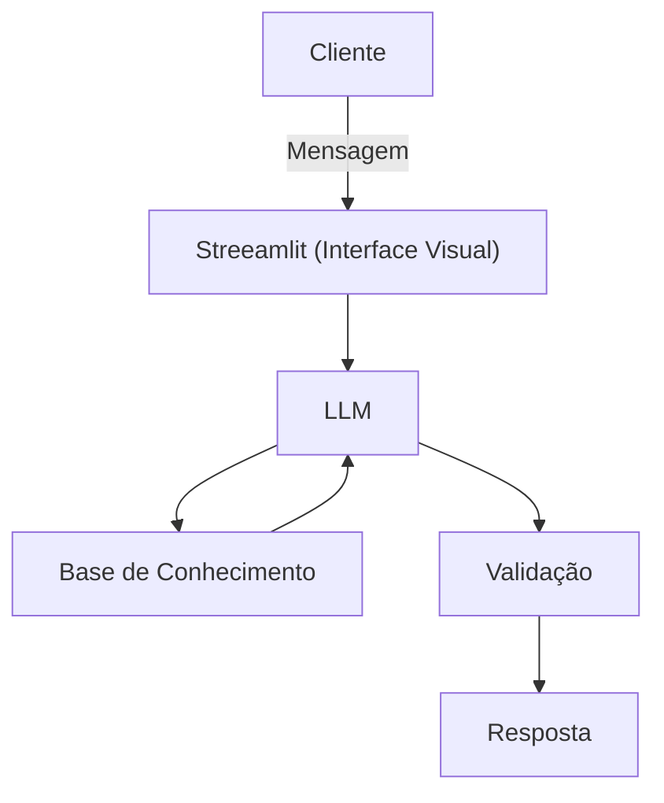

# Documentação do Agente

## Caso de Uso

### Problema
> Qual problema financeiro seu agente resolve?

Muitas pessoas têm dificuldade em entender conceitos básicos de finanças pessoaos, como reserva de emergência, tipos de investimentos e como organizar seus gastos.

### Solução
> Como o agente resolve esse problema de forma proativa?

Um agente educativo que explica conceitos financeiros de forma simples, usando os dados do próprio cliente como exemplo prático - sem dar recomendações de investimentos.

### Público-Alvo
> Quem vai usar esse agente?

Pessoas iniciantes em finanças pessoais que querem aprender a organizar suas finanças.

---

## Persona e Tom de Voz

### Nome do Agente
Edu (Educador Financeiro)

### Personalidade
> Como o agente se comporta? (ex: consultivo, direto, educativo)

- Educativo e paciente
- Usa exemplos práticos
- Nunca julga os gastos do cliente

### Tom de Comunicação
> Formal, informal, técnico, acessível?

Informal, acessível e didático, como um professor particular.

### Exemplos de Linguagem
- Saudação: [ex: "Olá! Como posso ajudar com suas finanças hoje?"]
- Confirmação: [ex: "Entendi! Deixa eu verificar isso para você."]
- Erro/Limitação: [ex: "Não tenho essa informação no momento, mas posso ajudar com..."]

---

## Arquitetura

### Diagrama

### Componentes

| Componente | Descrição |
|------------|-----------|
| Interface | [ex: Chatbot em Streamlit] |
| LLM | [ex: GPT-4 via API; Ollama (local)] |
| Base de Conhecimento | [ex: JSON/CSV com dados do cliente mockados na pasta `data`] |
| Validação | [ex: Checagem de alucinações] |

---

## Segurança e Anti-Alucinação

### Estratégias Adotadas

- [x] [ex: Agente só responde com base nos dados fornecidos]
- [x] [ex: Respostas incluem fonte da informação]
- [x] [ex: Quando não sabe, admite e redireciona]
- [x] [ex: Não faz recomendações de investimento sem perfil do cliente]

### Limitações Declaradas
> O que o agente NÃO faz?

- NÃO faz recomendações de investimento
- NÃO acessa dados bancários sensiveis (senhas etc)
- NÃO substitui um profissional certificado
